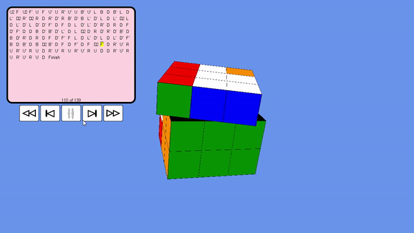
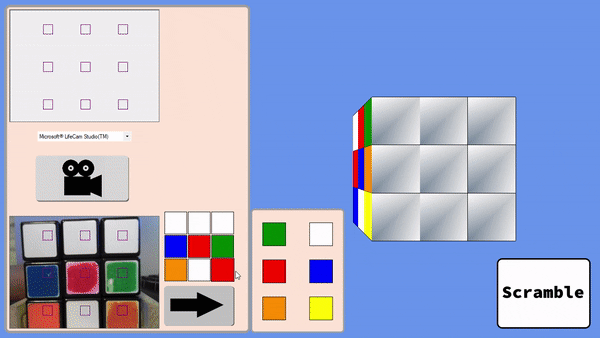
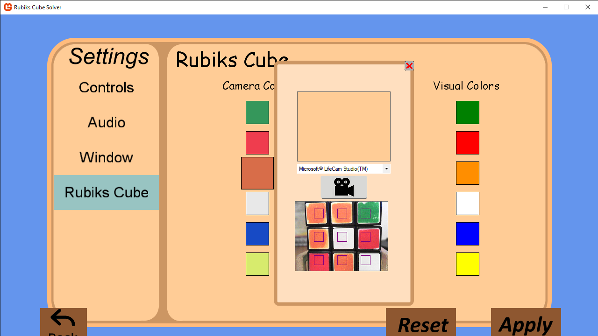

# Rubiks Cube Solver Built With Monogame

Monogame application that is able to solve rubiks cubes entered either manually or through a webcamera to create the representation of the rubiks cube. The solution to the cube is then displayed visually in 3D to the user.

  

  

  

## Built With
[Monogame](https://www.monogame.net/)

## Features

* Input manually or through webcamera
* Settings to adjust the programs understanding of colors to the enviroment and the live cubes colors
* Settings to change visual color representation

## Issues

* Webcamera has some problems depending on their resolution
* Color picker works rather badly in dark or very light areas
